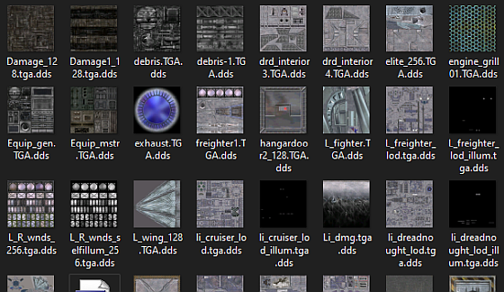
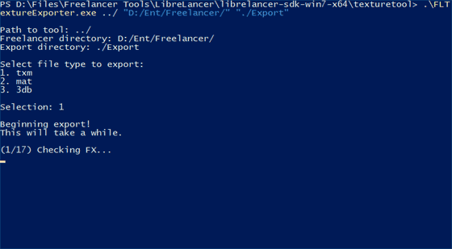

# Freelancer Texture Exporter


This is a simple command line tool using the [Librelancer](https://librelancer.net/) to export the textures from every `.txm`, `.mat`, and `.3db` file in Freelancer. This includes stuff like ships, stations, effects, solars, and more.

### [Download the latest release here](https://github.com/brihernandez/FLTextureExporter/releases/download/1.0/FLTextureExporter.zip)

## Dependencies
Requires the Librelancer SDK, which can be found here:

https://librelancer.net/downloads.html

*As of January 11 2022, this requires a **daily** build, and not the stable build.*

## How to use



Run `FLTextureExporter` in the command line with the following arguments:

* Path to the Librelancer SDK
* Path to the Freelancer directory you want to extract
* Directory to export all the textures to

For example:

```
FLTextureExporter.exe "C:\Freelancer Tools\Librelancer SDK" "C:\Program Files (x86)\Microsoft Games\Freelancer" ".\Export"
```

## Changelog

1.0 (January 11 2022)
- Initial release
